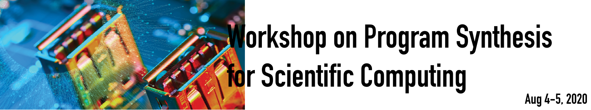

# Workshop on Program Synthesis for Scientific Computing (PSW)

The US Department of Energy is planning an aggressive research program as part of its AI initiative, and as highlighted in the recently-released AI for Science [report](https://www.anl.gov/ai-for-science-report) (see section 9), **program synthesis** and other high-level, AI-integrated programming methods will potentially be an important part of this program. The workshop will explore opportunities to develop program synthesis techniques that apply to scientific programming.

### Topics of Interest

The topics of interest include (but not limited to):

 * Methods for injecting application requirements (e.g., natural-language descriptions, mathematical specifications, examples of desired behavior).

 * Methods for searching the space of potentially-suitable programs (e.g., reinforcement learning and other machine-learning techniques, counter-example-driven refinement, evolutionary methods, optimization methods).

 * Methods for verifying the correctness of potential programs or increasing the confidence of correctness in existing programs (including formal methods providing both absolute and statistical guarantees).

 * Methods reflecting the multi-objective nature of these problems, including performance, power efficiency, verifiability, and understandability.

### Goals

This workshop aims to gather experts in program synthesis together with experts in scientific application development in order to generate concrete ideas for future research. A summary of these ideas will be used to generate a report that will help inform DOE's efforts in this space.

### Registration and Format

There is no fee to attend the workshop. However, space is limited and registration is required. This event is an **online workshop**.

## Dates

The workshop dates are August 4-5, 2020.

### <a class="anchor" name="agenda"> Agenda </a> 

#### Day 1 (Aug/4)

| Time (CDT) | Module | Presenter | Slides | Meeting Link |
|------|--------|-----------|--------|
10:00 - 10:15 | Welcome & Logistics | Hal/Ignacio | [slides](#) | [BlueJeans](#) |
10:15 - 11:00 | Keynote 1 | Name LastName | [slides](#) | [BlueJeans](#) |
11:00 - 12:30 | Breakouts 1 | Name LastName | [slides](#) | [BlueJeans](#) |
12:30 - 1:00 |  Break |  | | |
1:00 - 1:15 | Readout (applications breakout only) | Name LastName | [slides](#) | [BlueJeans](#) |
1:15 - 3:00 | Breakouts 2 | Name LastName | [slides](#) | [BlueJeans](#) |
3:00 - 4:00 | Readouts | | | [BlueJeans](#) |

#### Day 2 (Aug/5)

| Time (CDT) | Module | Presenter | Slides | Meeting Link |
|------|--------|-----------|--------|
10:00 - 10:15 | Feedback and Logistics | Hal/Ignacio | [slides](#) | [BlueJeans](#) |
10:15 - 11:00 | Keynote 2 | Name LastName | [slides](#) | [BlueJeans](#) |
11:00 - 12:30 | Breakouts 3 | Name LastName | [slides](#) | [BlueJeans](#) |
12:20 - 1:00 | Break | | | |
1:00 - 2:00 | Breakouts 4 (discussion plus writing) | Name LastName | [slides](#) | [BlueJeans](#) |
2:00 - 2:45 | Readout | Name LastName | [slides](#) | [BlueJeans](#) |
2:45 - 3:00 | Closing Remarks | Hal/Ignacio | [slides](#) | [BlueJeans](#) |

### Contact
 
 Please address workshop questions to Hal Finkel (hfinkel@anl.gov) and/or Ignacio Laguna (ilaguna@llnl.gov).
